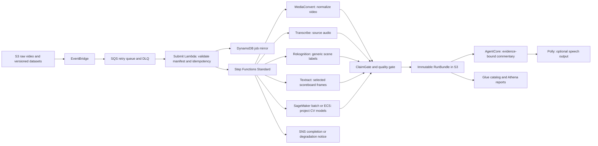

# NBA AWS Video Analysis Architecture Upgrade

**Status:** Design for review  
**AWS account/region:** `766815611718` / `us-east-1`  
**Evidence checked:** 2026-10-07, using AWS CLI v2 with `--profile nba`

## Objective

Build a real, evidence-producing AWS video-analysis pipeline around the trained basketball models. Every service counted as integrated must process a run-scoped input and produce a persisted output or trace. A resource existing in the account, an adapter in source, or a successful local synth does not by itself prove runtime use or model quality.

The official competition service-scoring rubric and model acceptance thresholds were not supplied. This design therefore makes no claim that a particular service count earns a particular score. Map the final service selection and metrics to the official rubric before claiming points.

## Account Baseline

- SageMaker lists 72 training jobs: 54 completed, 11 failed, 5 stopped, and 2 in progress at inspection time.
- SageMaker has no registered models, model-package groups, experiments, endpoints, or transform jobs. Training artifacts are written to S3 and are not promoted through a managed model registry.
- The main training/data bucket, `nba-hackathon-766815611718-team41`, has S3 versioning enabled. The deployed EventBridge rule instead watches the front-end site bucket's `raw/` prefix and invokes the raw-upload Lambda. The main data bucket has no bucket notification configuration.
- The deployed Step Functions state machine has two states: ECS `RenderVideo` with a task token, then Lambda `FinalizeJob`. One successful execution was present. Training and optional media analysis are not part of this state machine.
- Existing resources include S3, CloudFront, API Gateway, Lambda, DynamoDB, Step Functions, ECS, ECR, SageMaker training, Cognito, Secrets Manager, and ready AgentCore Runtime/Gateway/Memory resources.
- No SQS queues or SNS topics were found. No Transcribe jobs, Polly synthesis tasks, completed MediaConvert jobs, Glue databases, OpenSearch domains, SageMaker endpoints, or SageMaker Batch Transform jobs were found. CloudTrail had no Rekognition or Textract management calls in its available event history.
- Athena has the default `primary` workgroup, but no Glue database is catalogued. A workgroup alone is not a reporting pipeline.

## Training Evidence

| Model / evaluation | Evidence | Assessment |
|---|---|---|
| Player detector | 1,196 images; 1,140 train, 32 validation, 24 test; test mAP50 0.85383, mAP50-95 0.53541 | Promising result, but the test set is too small to establish cross-game generalization. |
| Ball/foot/player detector | 582 images; 510 train, 36 validation, 36 test; test mAP50 0.75782, mAP50-95 0.43910; validation 0.86519 / 0.51071 | Test performance is materially below validation; investigate split distribution, label quality, and domain shift before promotion. |
| Court keypoint comparison | 116 test images; YOLO detection rate 1.0, hull IoU 0.7967; RF-DETR detection rate 1.0, hull IoU 0.8567; PCK at 2% diagonal 0.9539 / 0.9355 | RF-DETR has stronger hull overlap but averages 1.54 seconds/frame versus YOLO's 0.478 seconds/frame. The 16 Macau images have no ground truth and are not an accuracy test. |
| RF-DETR training attempt | `rfpk-rtrain-r1-1007-055110` failed with `ImportError: cannot import name 'BackboneConfigMixin' from transformers` | Fix and pin the training image dependencies before rerunning. |
| Pose training | Two current jobs were in progress; earlier jobs stopped with `MaxRuntimeExceeded` | Do not promote until training completes and emits comparable validation/test metrics. |

SageMaker `FinalMetricDataList` was empty for sampled jobs, even where custom S3 manifests contained metrics. Training code should publish named metrics to SageMaker and preserve the same metrics in the run evidence bundle.

## Target Flow



The training lifecycle is separate from per-video processing:

```text
versioned S3 dataset + manifest
  -> SageMaker Pipeline train/evaluate
  -> metrics and model artifact
  -> Model Registry candidate
  -> approval gate
  -> versioned batch inference or endpoint, selected by latency needs
```

## Components and Contracts

### 1. Run intake and orchestration

- Route events from the actual raw-video bucket, not the front-end site bucket unless that bucket is intentionally the upload source.
- Place SQS between upload events and submit processing; configure a DLQ and bounded retries. Submit Lambda validates the manifest and writes an idempotent DynamoDB job record before starting Step Functions.
- Standardize the run manifest: `run_id`, input S3 URI and SHA-256, dataset/version identifiers, model versions, region, creation time, and expiry.
- Step Functions runs independent media sidecars in parallel and then joins them at a single ClaimGate. Optional service failure is recorded per branch; it must not fabricate evidence or silently mark the overall run as fully analyzed.

### 2. Video and model analysis

- MediaConvert normalizes supported input media and writes only to run-scoped staging.
- Transcribe extracts source commentary with job ARN and transcript object recorded.
- Rekognition provides generic labels as a sidecar. It is not the basketball detector and cannot override project-model output or verified game state.
- Textract reads selected scoreboard frames. OCR output remains untrusted evidence until validated against other sources.
- Existing YOLO/RF-DETR models run in SageMaker Batch Transform or the existing ECS worker for offline full-game processing. Use an endpoint only if measured latency requires online inference.
- Add SageMaker metric definitions, Experiments/Pipeline lineage, and Model Registry versions. Promote only after evaluation on a game-disjoint holdout; record per-class metrics and at least one domain-shift set with ground truth.

### 3. Evidence, agent, and reporting

- Each branch writes to `staging/{run_id}` and records service name, job ARN/ID, input/output object URIs, SHA-256 values, status, timestamps, and CloudWatch log/trace references.
- ClaimGate checks schema, required outputs, metric thresholds, source provenance, and conflicts. Failed claims remain suppressed.
- Finalize writes an immutable RunBundle and updates the published pointer conditionally. No worker or optional adapter writes the current pointer directly.
- AgentCore consumes only ClaimGate-approved facts. Polly is optional and synthesizes only the approved commentary plan; text output remains available if synthesis fails.
- Glue catalogs completed RunBundles and Athena produces run-level coverage, quality, and service-evidence reports. SNS reports completion or degradation with the run ID and report location.

## Rollout and Acceptance

1. **Evidence and routing foundation:** define the manifest and RunBundle schema, add metric definitions, verify the true upload bucket, and add EventBridge-to-SQS/DLQ routing. Demonstrate one end-to-end run with idempotent retry behavior.
2. **Real video-service calls:** add MediaConvert, Transcribe, Rekognition, and Textract as parallel, run-scoped branches. For each enabled service, retain a successful ARN/job ID, output SHA, and trace in the RunBundle. Do not claim service use from resource creation alone.
3. **Model governance:** move repeatable train/evaluate runs into SageMaker Pipelines, register candidates, block promotion on missing metrics, and compare approved candidates using game-disjoint test sets. Fix the RF-DETR dependency pin and inspect the ball/foot validation-to-test gap.
4. **Scoring/reporting:** catalog RunBundles with Glue, query them with Athena, and send SNS notifications. Enable Polly only for runs with approved commentary text.
5. **Release proof:** provide one CloudFront demo run that links input, service jobs, trained model versions, ClaimGate result, immutable bundle, and logs. Recalculate service points from the official rubric.

Release acceptance requires: correct account and `us-east-1`; no duplicate run from a replayed S3 event; one immutable RunBundle per successful run; persisted input/output hashes and service ARNs; model metrics surfaced through SageMaker and the bundle; failed optional branches visible; and no unverified claim reaching AgentCore commentary.

## Boundaries

- No AWS resource has been created or changed during this audit.
- This specification does not assume that deploying every unused AWS service increases the score. Services without a meaningful run-scoped input/output are excluded until the official rubric or product need justifies them.
- The GitHub source repository was not cloned because GitHub content transfer failed in this environment. Implementation must wait for a working local clone/archive and re-check its latest `main` revision before code edits.
- All implementation work is local-only. Do not push commits or change GitHub-hosted files.
